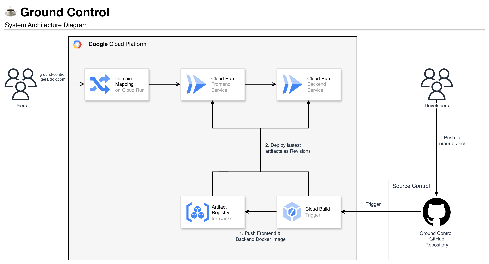

<div align="center">
  
  <h1>☕️ Ground Control</h1>
  <p style="font-size:16px;font-weight:normal;">Full-stack cafe management system</p>
</div>

<div align="center">
  <p align="center">
    <a href="#introduction">Introduction</a> &nbsp;&bull;&nbsp;
    <a href="#system-overview">System Overview</a> &nbsp;&bull;&nbsp;
    <a href="#getting-started">Getting Started</a>
  </p>
</div>


## Introduction

**Ground Control** is a full-stack cafe management system designed to manage **cafes, employees, and their assignments**. It provides a clean, responsive, table-driven interface for operations while exposing a robust API for backend logic.

Built with a modern, containerised stack, the project supports both **local development** and **cloud-native deployment**.


## System Overview

### System Architecture




The application follows a **client-server architecture**:

* **Frontend (React + Vite)** communicates with the backend via REST APIs  
* **Backend (FastAPI)** handles business logic and database operations  
* **PostgreSQL** persists application data  
* **Docker Compose** orchestrates services locally for development

**Cloud Deployment:**  
The application is deployed on **Google Cloud Run** behind a custom domain mapping, with data hosted on **PostgreSQL/Supabase**. A **Cloud Build** pipeline automates CI/CD, building images for both frontend and backend, storing them in **Google Artifact Registry**, and deploying to Cloud Run.  


### Tech Stack

**Frontend**


**Backend**


**Database**


**Infrastructure & Tooling**


### Repository Structure

```
.
├── backend/           # FastAPI application, models, migrations, seed scripts
├── frontend/          # React application
├── cloudbuild.yaml    # CI/CD pipeline for automated builds & deployments
├── docker-compose.yml # Local orchestration
```


## Getting Started

### Pre-requisites

* Git - a tool for version control and collaboration
* [Docker Desktop](https://docs.docker.com/get-started/get-docker/) - a tool to containerise apps to ensure running consistency across various environments
* Node.js 22+ (optional, for local frontend dev)
* Python 3.12+ (optional, for local backend dev)
* (Optional) [pgAdmin](https://www.pgadmin.org/download/) - a tool used for managing databases through a user-friendly graphical interface

### 1. Clone the Repository

Clone this repository and navigate into the project folder:

```shell
git clone git@github.com:callmegerlad/ground-control.git
cd ground-control
```

### 2. Load Environment Variables

Load the required environment variables from the frontend and backend `.env` files by copying from their respective example files below:

```shell
cp ./backend/.env.example ./backend/.env
```

### 3. Build and Run the Application with Docker

Build the container images and start them:

```shell
docker-compose up --build
```

Services will be available at:

* Frontend → [http://localhost:5173](http://localhost:5173)
* Backend → [http://localhost:8000](http://localhost:8000)
* API Docs → [http://localhost:8000/docs](http://localhost:8000/docs)

### 4. Seed the Database

Apply migrations & seed the database for the first time setup:

```shell
docker-compose exec backend python manage_db.py seed
```

> 💡 Tip: To reset and reseed the database, run the following command.
> ```shell
> docker-compose exec backend python manage_db.py reset
> ```

### 5. Set up Development Environment

To start development, we will create a dedicated virtual environment on our local machines for this project.

```shell
cd backend
python -m venv venv
source venv/bin/activate
```

### 6. Install Packages

Finally, while still in the `backend/` directory, install all required dependencies to finish setting up our virtual environment.

```shell
pip install -r requirements.txt
```

And likewise, we install all the required packages for the frontend.

```shell
cd ../frontend
npm i
```

---

### Useful Commands

To run backend tests:

```shell
docker-compose exec backend pytest -v
```

To clear the database:

```shell
docker-compose exec backend python manage_db.py clear
```


## License

This project is for technical assessment and demonstration purposes.
