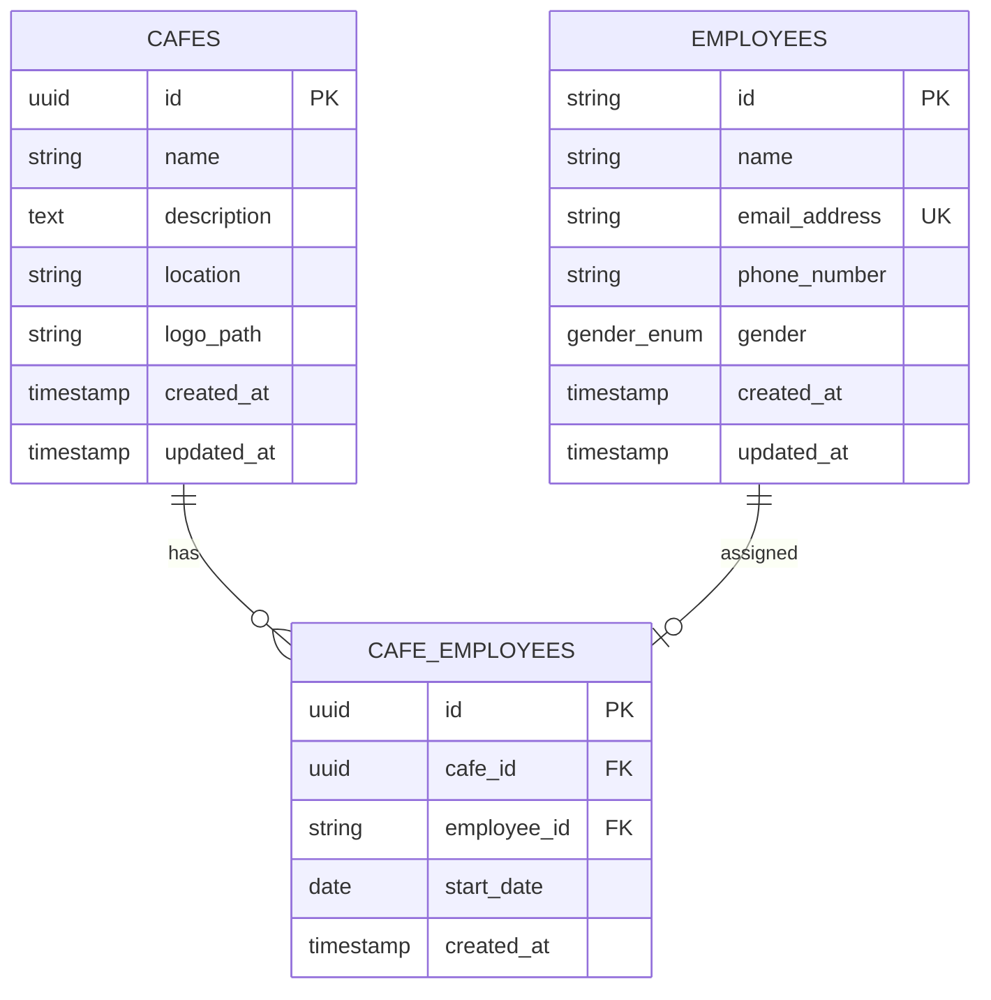

# Ground Control Database Documentation

## Overview

Ground Control uses PostgreSQL with SQLAlchemy ORM to manage cafe and employee data. The database is designed to track cafe locations and their employee assignments.

## Database Schema

### Entity Relationship Diagram



## Table Definitions

### Cafes Table

Stores information about all registered cafes in the network.

| Column | Type | Constraints | Description |
|--------|------|-------------|-------------|
| `id` | UUID | PK, Default: uuid4() | Unique identifier for the cafe |
| `name` | String(255) | NOT NULL | Name of the cafe |
| `description` | Text | NOT NULL | Detailed description of the cafe |
| `location` | String(255) | NOT NULL | Physical location/address |
| `logo_path` | String(512) | NULLABLE | Path to cafe logo image |
| `created_at` | DateTime | NOT NULL, Default: now() | Timestamp when cafe was created |
| `updated_at` | DateTime | NOT NULL, Default: now() | Timestamp of last update |

**Relationships:**
- One-to-Many with `cafe_employees` (cascade delete orphans)

---

### Employees Table

Stores information about all employees across cafes.

| Column | Type | Constraints | Description |
|--------|------|-------------|-------------|
| `id` | String(9) | PK | Employee ID in format `UIXXXXXXX` |
| `name` | String(255) | NOT NULL | Full name of employee |
| `email_address` | String(255) | NOT NULL, UNIQUE | Email address (unique) |
| `phone_number` | String(8) | NOT NULL | 8-digit phone number (8xxxxx or 9xxxxx) |
| `gender` | Enum | NOT NULL | Gender (male/female) |
| `created_at` | DateTime | NOT NULL, Default: now() | Timestamp when employee was created |
| `updated_at` | DateTime | NOT NULL, Default: now() | Timestamp of last update |

**Constraints:**
- Employee ID Format: `^UI[A-Za-z0-9]{7}$` (regex constraint)
- Phone Number Format: `^[89][0-9]{7}$` (starts with 8 or 9, 8 digits total)
- Email must be unique

**Relationships:**
- One-to-Many with `cafe_employees` (cascade delete orphans)

---

### CafeEmployees Table

Tracks the assignment of employees to cafes with employment start dates.

| Column | Type | Constraints | Description |
|--------|------|-------------|-------------|
| `id` | UUID | PK, Default: uuid4() | Unique identifier for assignment |
| `cafe_id` | UUID | FK → cafes.id, NOT NULL | Reference to cafe |
| `employee_id` | String(9) | FK → employees.id, NOT NULL | Reference to employee |
| `start_date` | Date | NOT NULL | Employee's start date at cafe |
| `created_at` | DateTime | NOT NULL, Default: now() | Timestamp of assignment creation |

**Indexes:**
- `ix_cafe_employees_cafe_id` on `cafe_id`
- `ix_cafe_employees_employee_id` on `employee_id`

**Unique Constraints:**
- `uq_cafe_employees_cafe_employee`: Unique pair of (cafe_id, employee_id)
- `uq_cafe_employees_employee_single_cafe`: Employee can only work at one cafe

**Foreign Key Constraints:**
- `cafe_id` → `cafes.id` with ON DELETE CASCADE
- `employee_id` → `employees.id` with ON DELETE CASCADE

**Relationships:**
- Many-to-One with `cafes`
- Many-to-One with `employees`

## Database Seeding

### Overview

Your Ground Control database can be populated with sample data including some trendy cafes and randomly generated employees.

### Seeding Commands

#### Using Database Manager

```bash
# Seed database (if empty)
python manage_db.py seed

# Clear all data
python manage_db.py clear

# Reset (clear + re-seed)
python manage_db.py reset
```

## Database Migrations

Ground Control uses **Alembic** for database version control and schema management. Alembic allows us to track database changes, version the schema, and easily deploy migrations across different environments.

### Useful Migration Commands

**Apply pending migrations (upgrade):**
```bash
alembic upgrade head
```

**Downgrade to a specific revision:**
```bash
alembic downgrade -1    # Go back one migration
alembic downgrade base # Rollback all migrations
```
